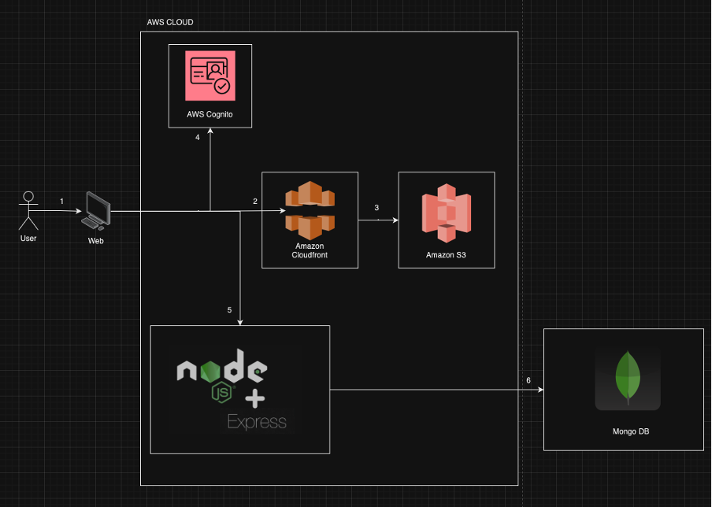

Technology Stack:
    React
    Bootstrap
    AWS Cognito
    AWS CloudFront
    AWS S3

Local setup:
    1. Clone the repo to your local
    2. cd Capstone_Frontend
    3. npm install
    4. npm run dev
    5. Open the browser of your choice
    6. Open http://localhost:5173 to launch the application

Deployment:
    A Github Actions pipeline automatically deploys the code to AWS CloudFront and AWS S3 when any change is pushed or merged to the main branch.

Authentication:
    AWS Cognito

Architecture:
    

Support
    Bhavik Yakkarnall - (Email: byakkarnall@gmail.com)